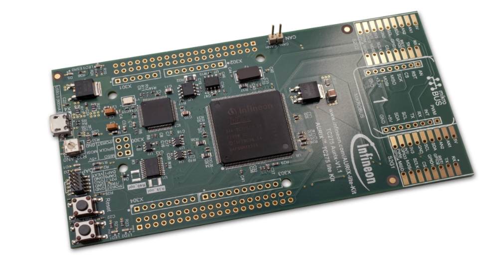
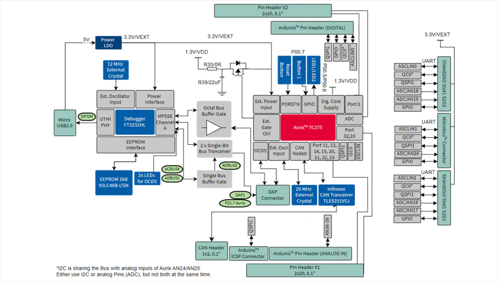
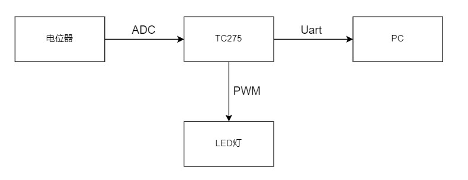

# FunPack第二季第二期




# 板卡介绍

AURIX TM TC275 lite 套件配备了基于 32 位单芯片 AURIX TM TriCore TM的微控制器 Aurix TM TC275。芯片内部集成了三颗高性能的Tri 核心，可同时进行实施控制。英飞凌也维护了一套完整的AutoSAR软件框架，对工业和汽车级开发提供了极大便利。

## 芯片主要参数

- 具有 200MHz 和 DSP 功能的三重三核（三个高性能 32 位超标量三核 V1.6.1 CPU，在整个汽车温度范围内以 200MHz 运行）

- 4MB 闪存，带 ECC 保护（每个内核专用紧密耦合的内存区域）

- 64 KB EEPROM，500 k 周期

- 472KB RAM，带 ECC 保护

- 64x DMA 渠道

- 传感器接口 ：10 x发送, 3倍PSI5, 1个PSI5S

- 最先进的连接性： 1x以太网 100 Mbit , 1个 弹性射线 , 4倍ASCLIN, 4倍QSPI, 1个I²C , 2 倍MSC , 1个HSSL, I²S 仿真 , 5 xCAN 包括数据速率增强型 CAN FD

- 可编程的 HSM （硬件安全模块）

- 单电压供电 5V 或 3.3V

- 环境温度范围 -40°C...+125°C




# 任务目标

设计一个呼吸灯，通过旋转板卡上的电位计，改变呼吸灯闪烁速率，同时将ADC采集的数据通过串口/CAN，发送到另一台设备上显示

# 设计思路

通过采集板载电位器的实时电压值，并将其结果映射到PWM发生器对应输出的频率范围内，再由对应的PWM控制器输出相应频率占空比50%的PWM波控制LED进行闪烁。并周期性的将ADC采样值通过串口以115200 波特率发送到电脑的串口调试助手中。

## 系统拓扑



# 实施细节
## 串口模块
参考源码例程中的`ASCLIN_UART_1_KIT_TC275_LK` Demo程序进行改写,主要代码如下：

```c
/* This function initializes the ASCLIN UART module */
void uart_Init(void) {
    /* Initialize an instance of IfxAsclin_Asc_Config with default values */
    IfxAsclin_Asc_Config ascConfig;
    IfxAsclin_Asc_initModuleConfig(&ascConfig, &MODULE_ASCLIN0);

    /* Set the desired baud rate */
    ascConfig.baudrate.baudrate = 115200;

    /* ISR priorities and interrupt target */
    ascConfig.interrupt.txPriority = INTPRIO_ASCLIN0_TX;
    ascConfig.interrupt.rxPriority = INTPRIO_ASCLIN0_RX;
    ascConfig.interrupt.typeOfService = IfxCpu_Irq_getTos(IfxCpu_getCoreIndex());

    /* FIFO configuration */
    ascConfig.txBuffer = &g_ascTxBuffer;
    ascConfig.txBufferSize = UART_TX_BUFFER_SIZE;
    ascConfig.rxBuffer = &g_ascRxBuffer;
    ascConfig.rxBufferSize = UART_RX_BUFFER_SIZE;

    /* Pin configuration */
    const IfxAsclin_Asc_Pins pins = {
            .rx        = &UART_PIN_RX,
            .rxMode    = IfxPort_InputMode_noPullDevice,
            .tx        = &UART_PIN_TX,
            .txMode    = IfxPort_OutputMode_pushPull,
            .cts       = NULL_PTR,
            .ctsMode   = IfxPort_InputMode_noPullDevice,
            .rts       = NULL_PTR,
            .rtsMode   = IfxPort_OutputMode_pushPull,
            .pinDriver = IfxPort_PadDriver_cmosAutomotiveSpeed1
    };
    ascConfig.pins = &pins;

    IfxAsclin_Asc_initModule(&g_ascHandle, &ascConfig); /* Initialize module with above parameters */
}

void uart_SendStr(char* str) {
    Ifx_SizeT len = (Ifx_SizeT)strlen(str);
    IfxAsclin_Asc_write(&g_ascHandle, str, &len, TIME_INFINITE);   /* Transmit data via TX */
}
```

`uart_Init`函数用来初始化串口功能，`uart_SendStr`函数用来进行串口数据的发送，这里在使用的时候需要配合标准string.h 库中的sprintf 进行使用。

## ADC模块

需求中非常明确的给出了仅采集单路ADC电压值，因此我们参考官方的`ADC_Single_Channel_1_KIT_TC275_LK` 进行修改即可，主要代码如下：

```c
void adc_init() {
    /* VADC module configuration */
    /* Create VADC configuration */
    IfxVadc_Adc_Config adcConfig;

    /* Initialize the VADC configuration with default values */
    IfxVadc_Adc_initModuleConfig(&adcConfig, &MODULE_VADC);

    /* Initialize the VADC module using the VADC configuration */
    IfxVadc_Adc_initModule(&g_vadcBackgroundScan.vadc, &adcConfig);

    /* VADC group configuration */
    /* Create group configuration */
    IfxVadc_Adc_GroupConfig adcGroupConfig;

    /* Initialize the group configuration with default values */
    IfxVadc_Adc_initGroupConfig(&adcGroupConfig, &g_vadcBackgroundScan.vadc);

    /* Define which ADC group is going to be used */
    adcGroupConfig.groupId = VADC_GROUP;
    adcGroupConfig.master = VADC_GROUP;

    /* Enable background scan source */
    adcGroupConfig.arbiter.requestSlotBackgroundScanEnabled = TRUE;

    /* Enable background auto scan mode */
    adcGroupConfig.backgroundScanRequest.autoBackgroundScanEnabled = TRUE;

    /* Enable the gate in "always" mode (no edge detection) */
    adcGroupConfig.backgroundScanRequest.triggerConfig.gatingMode = IfxVadc_GatingMode_always;

    /* Initialize the group using the group configuration */
    IfxVadc_Adc_initGroup(&g_vadcBackgroundScan.adcGroup, &adcGroupConfig);

    /* Initialize the channel configuration of application handle g_vadcBackgroundScan with default values */
    IfxVadc_Adc_initChannelConfig(&g_vadcBackgroundScan.adcChannelConfig, &g_vadcBackgroundScan.adcGroup);

    g_vadcBackgroundScan.adcChannelConfig.channelId = (IfxVadc_ChannelId)CHANNEL_ID;
    g_vadcBackgroundScan.adcChannelConfig.resultRegister = (IfxVadc_ChannelResult)CHANNEL_RESULT_REGISTER;
    g_vadcBackgroundScan.adcChannelConfig.backgroundChannel = TRUE;

    /* Initialize the channel of application handle g_VadcBackgroundScan using the channel configuration */
    IfxVadc_Adc_initChannel(&g_vadcBackgroundScan.adcChannel, &g_vadcBackgroundScan.adcChannelConfig);

    /* Enable background scan for the channel */
    IfxVadc_Adc_setBackgroundScan(&g_vadcBackgroundScan.vadc,
                                  &g_vadcBackgroundScan.adcGroup,
                                  (1 << (IfxVadc_ChannelId)CHANNEL_ID),
                                  (1 << (IfxVadc_ChannelId)CHANNEL_ID));

    /* Start background scan conversion */
    IfxVadc_Adc_startBackgroundScan(&g_vadcBackgroundScan.vadc);
}

uint32  adc_get_val() {
    Ifx_VADC_RES conversionResult;
    uint16 retry = 0;
    do {
        conversionResult = IfxVadc_Adc_getResult(&g_vadcBackgroundScan.adcChannel);
        if (retry++ > RETRY_MAX) {
            return 0xffffffff;
        }
    } while (!conversionResult.B.VF);

    return conversionResult.B.RESULT;
}
```

`adc_init`函数对ADC进行初始化 ，然后通过`adc_get_val`函数即可通过阻塞方式从寄存器中读取采集到的ADC值，这里使用的ADC量程为4096级，所以在应用程序中做ADC电压转换时候可以通过以下公式进行转换：


## PWM模块

这里我们参考官方Demo中的单路PWM(GTM)的`GTM_TOM_PWM_1_KIT_TC275_LK`程序，输出一路周期可调的PWM，关键代码如下：

```c
void pwm_init() {
    init_Smu();                         /* Initialization of SMU module*/
    init_IR();                          /* Initialization of the Interrupt Router module*/
    init_Iom();                         /* Initialization of the IOM module*/
    init_Gtm_Pwm();                     /* Initialization of the GTM module and creation of the PWM signal*/
}

void changePeriod(uint32 period) {
    IfxGtm_Atom_Pwm_initConfig(&g_atomConfig, &MODULE_GTM);                 /* Initialize default parameters*/

    /* Configuration of the PWM signal used as Monitor signal by the IOM */
    g_atomConfig.atom = IfxGtm_Atom_0;                                      /* Select the ATOM 0*/
    g_atomConfig.atomChannel = IfxGtm_Atom_Ch_5;                            /* Select the channel 0*/
    g_atomConfig.period = period;                                       /* Set timer period */
    g_atomConfig.pin.outputPin = &P00_0;                                    /* Set P00_0 as output port pin */
    g_atomConfig.synchronousUpdateEnabled = TRUE;                           /* Enable synchronous update */
    g_atomConfig.dutyCycle = period / 2;                                /* Set duty cycle of 50% period*/

    IfxGtm_Atom_Pwm_init(&g_atomDriver, &g_atomConfig);                     /* Initialize the PWM  */
    IfxGtm_Atom_Pwm_start(&g_atomDriver, TRUE);                             /* Start the PWM */
}
```

`pwm_init` 函数用来初始化PWM功能， `changePeriod` 函数用来修改PWM的周期并且将PWM的占空比实时设置为50%。

## 应用逻辑实现

应用逻辑实现了将ADC值映射到PWM周期，当ADC值持续变换时候修改PWM的周期并且串口输出，主要代码如下：

```c
adc_val = adc_get_val();                /*  get adc val */
g_period = (adc_val * MAX_PERIOD) / 4096;   /*change adc val to pwm period*/

if(g_period_last != g_period)           /*  when g_period val change ,reset pwm period    */
{
g_period_last = g_period;
changePeriod(g_period);             /*  reset pwm period    */

sprintf(print_buf, "g_period:%d\r\n", g_period);        /*  uart printf */
uart_SendStr(print_buf);
}

wait(ticksFor100ms);                    /*  system tick delay   */
```

# 总结

​	TC275作为一颗汽车级的微控制器拥有性能强劲三核设计且配套设施完善，英飞凌提供了从IDE到软件框架等一系列工具来助力汽车行业开发者的使用。目前来说因为AutoSAR的封闭性对于个人开发者来说还不是特别的友好，无法以个人的身份在英飞凌的官网申请到AutoSAR的软件包，希望英飞凌可以对AutoSAR进行开放来助力开发者的学习。

​	作为一个汽车行业从业者来说，多核设计是一个较大的趋势。Tesla在很久之前就已经在整车上使用了多核域控制器，而国内的域控制器技术多为起步阶段，希望英飞凌可以开放更多的资料来助力国内汽车行业的发展。


# 视频


# 参考

## 1. 官方参考源码

https://github.com/Infineon/AURIX_code_examples.git

2. 英飞凌中国

[英飞凌——半导体与系统解决方案 - Infineon Technologies](https://www.infineon.com/cms/cn/)